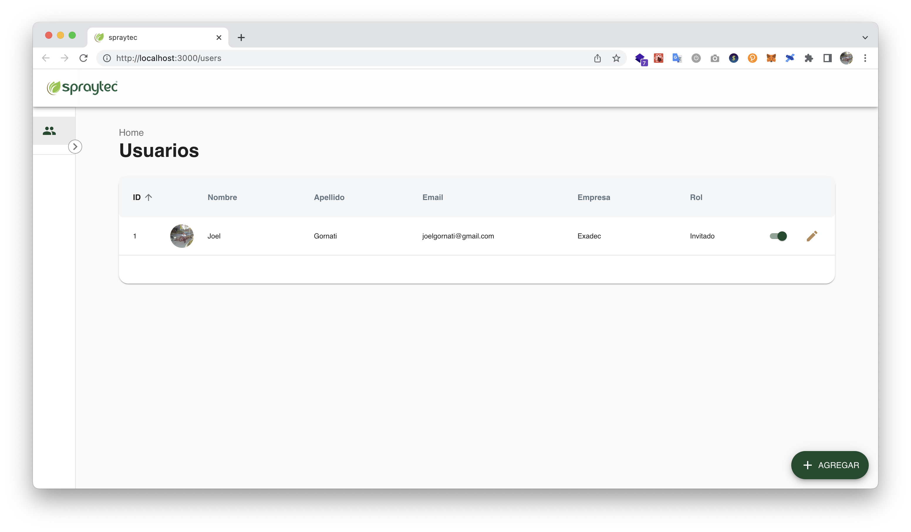

# Ejemplo completo de CRUD de usuario con foto de perfil

El siguiente proyecto contiene un ejemplo de un simple CRUD realizado en React (Cliente - Frontend) y Redux con un mock
server (API - Backend) realizado en
Node.js con express.



#### Estructura del proyecto:

- fake_api: carpeta contenedora del backend en node con express. El archivo FakeAPI.js realiza la inicialización de
  Express y la declaración de las rutas disponibles. Por una cuestión de simplicidad del proyecto se realizó en un único
  archivo. En proyecto más complejos sería conveniente separar la inicialización de Express por un lado y la declaración
  de rutas de cada modelo por otro lado. También está la carpeta Services que contiene la implementación de cada método
  utilizado en las rutas. Y por último la carpeta public, donde se guardan las fotos de perfil de los usuarios, es
  decir, donde Express sirve archivos estáticos.
- mock: contiene un archivo json con una base de datos ficticia de usuarios y roles.
- public: contiene los archivos públicos que se utilizan en el proyecto cliente.
- src: estructura del proyecto cliente de React con Redux.
    - actions: contiene todos los action creators del proyecto. Se utiliza redux-thunk para poder ejecutar más lógica
      dentro
      de los actions creators y así obtener un código más desacoplado.
    - api: contiene las llamadas a las apis usando el método fetch.
    - components: contiene todos los componentes de React que dan lugar a la interfaz de usuario.
        - Layout: contiene los componentes que son utilizados en toda la interfaz entre ellos la barra de navegación
          superior,
          la barra de navegación izquierda y los mensajes de error y mensajes correctos. Estos componentes son
          utilizados en el
          componente Layout de orden superior. Dentro de este componente se declararán todas las rutas que renderizarán
          los
          componentes que utilicen este Layout. Para este proyecto se omite la parte de inicio de sesión de usuario,
          pero si
          estuviera, solo podrían acceder a Layout los usuarios logueados.
        - Users: contiene los componentes que dan lugar al ABM de usuarios.
            - UserList: listado de todos los usuarios
            - CRUDUser: ABM de usuario. El ABM de usuario utiliza al componente FacePhoto para manejar la lógica de la
              foto de
              perfil. A su vez el componente FacePhoto utiliza los componentes dentro de la carpeta PhotoManager. Estos
              últimos
              contienen la lógica para permitir desde una computadora poder elegir una foto del sistema de archivos del
              sistema
              operativo o también poder elegir el uso de la cámara integrada para tomar una selfie. En el caso de los
              celulares
              utiliza directamente el menú que proveen los sistemas operativos.
    - constants: incluye constantes del sistema como las ips de los servidores
    - library: contiene personalización de algunos de los componentes de Material UI
    - normalizers: contiene la definición de los esquemas de los modelos para poder realizar una normalización e
      incluirlos
      en los stores correspondientes de Redux.
    - reducers: contiene los reducers que permiten realizar el manejo del store
    - reset: realiza los reset de los store según los modelos
    - styles: estilos globales de la aplicación
    - utils: carpeta para poner funciones que se utilizan globalmente, en este caso un hook personalizado para validar
      formularios. Este hook podría ser reemplazado por otra librería más completa.
    - index.js: contiene la inicialización del proyecto de React 


## Arrancar proyecto

### Instalar dependencias 
```
npm install 
```
### Iniciar Frontend
```
npm run start 
```
### Iniciar Backend
```
npm run startFakeApi
```
